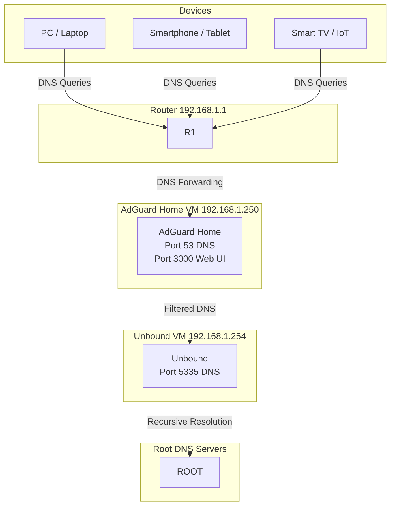

<div align="center">

# 🔒 Hardened Network Security Homelab

**Privacy-first home network with recursive DNS, ad-blocking, and encrypted DNS queries**

[](https://adguard.com/en/adguard-home/overview.html)
[](https://nlnetlabs.nl/projects/unbound/about/)
[](https://linux.org)
[](https://opensource.org/licenses/MIT)

> DNS-over-TLS · MITM Prevention · Network-wide Ad Blocking · Custom ACLs · Privacy Engineering

</div>

---

## 📌 Overview

This homelab project implements enterprise-grade network security on a home LAN using open-source tools. The setup replaces ISP-provided DNS with a self-hosted recursive resolver stack that provides:

- **Full DNS privacy** — no ISP eavesdropping on queries
- **Network-wide malware blocking** — covers all devices without per-device configuration
- **Encrypted DNS transport** — prevents Man-in-the-Middle attacks
- **Granular access control** — custom ACLs block tracking, phishing, and telemetry

---

## 🏗️ Architecture

```
┌──────────────────────────────────────────────────────────────┐
│                     Home Network (LAN)                       │
│                                                              │
│  [Devices: PC, Phone, IoT]                                   │
│       │                                                      │
│       ▼  DNS Query (port 53)                                 │
│  ┌─────────────────────────────────────┐                     │
│  │         AdGuard Home                │                     │
│  │  • Ad & malware blocklist filtering │                     │
│  │  • Custom ACL rules                 │                     │
│  │  • DNS query logging & analytics    │                     │
│  └──────────────┬──────────────────────┘                     │
│                 │  Forwarded to local resolver               │
│                 ▼                                            │
│  ┌─────────────────────────────────────┐                     │
│  │         Unbound (Recursive Resolver) │                    │
│  │  • Resolves from DNS root servers   │                     │
│  │  • DNSSEC validation                │                     │
│  │  • DNS-over-TLS (DoT) upstream      │                     │
│  └──────────────┬──────────────────────┘                     │
│                 │  Encrypted (DoT, port 853)                  │
│                 ▼                                            │
│        [DNS Root Servers / Trusted Upstream]                 │
└──────────────────────────────────────────────────────────────┘
```

---

## 🏗 Network Architecture 


## ⚔️ Threat Model

| Threat | Mitigation |
|--------|-----------|
| ISP DNS surveillance | Recursive resolution via Unbound (no upstream ISP DNS) |
| Man-in-the-Middle DNS attacks | DNS-over-TLS (DoT) encryption on all outbound queries |
| Phishing domains | AdGuard Home blocklists (updated daily) |
| Malware C2 callbacks | Network-wide DNS blocklist — catches all devices |
| Ad tracking / telemetry | Custom ACLs blocking major tracking domains |
| DNS rebinding attacks | Unbound private-address configuration |

---

## 🛠️ Components

### AdGuard Home
- **Role:** DNS sinkhole, ad/malware filter, query dashboard
- **Blocklists used:**
  - AdGuard DNS filter
  - Steven Black's Hosts (ads + malware)
  - OISD Blocklist
  - Custom company telemetry rules

### Unbound
- **Role:** Recursive DNS resolver (replaces forwarding to Google/Cloudflare)
- **Key configs:**
  - `do-dnssec: yes` — validates DNSSEC signatures
  - `tls-upstream: yes` — encrypts outbound DNS
  - `private-address` rules — blocks DNS rebinding
  - Query minimization — limits data sent to root servers

---

## ⚙️ Configuration Snippets

### Unbound — DNS-over-TLS upstream
```conf
# /etc/unbound/unbound.conf

server:
    verbosity: 1
    do-dnssec: yes
    tls-upstream: yes
    
    # DNS rebinding protection
    private-address: 192.168.0.0/16
    private-address: 10.0.0.0/8
    
    # Minimize query data sent to root servers
    qname-minimisation: yes

forward-zone:
    name: "."
    forward-tls-upstream: yes
    forward-addr: 1.1.1.1@853#cloudflare-dns.com
    forward-addr: 9.9.9.9@853#dns.quad9.net
```

### AdGuard Home — Custom ACL rules (sample)
```
# Block telemetry
||telemetry.microsoft.com^
||data.microsoft.com^
||settings-win.data.microsoft.com^

# Block tracking
||doubleclick.net^
||google-analytics.com^
||facebook.com/tr^

# Block malware domains (example)
||malware-domain-example.com^
```

---

## 📊 Results

After deployment, AdGuard Home dashboard showed:
- **~25-35% of all DNS queries** blocked network-wide
- Zero ISP-visible DNS queries (all resolved locally or via DoT)
- Significant reduction in ad load on all household devices
- Full visibility into per-device DNS activity

---

## 🚀 Setup Guide

### Prerequisites
- Linux server or Raspberry Pi (Debian/Ubuntu recommended)
- Static IP on your LAN
- Router access to change DNS server

### Install Unbound
```bash
sudo apt update && sudo apt install unbound -y
sudo systemctl enable unbound
```

### Install AdGuard Home
```bash
curl -s -S -L https://raw.githubusercontent.com/AdguardTeam/AdGuardHome/master/scripts/install.sh | sh -s -- -v
```

### Point AdGuard → Unbound
In AdGuard Home settings → DNS → Upstream DNS servers:
```
127.0.0.1:5335
```

### Point your router's DNS → AdGuard Home
Set your router's DNS server to the static IP of your AdGuard Home machine.

---

## 🔧 Hardening Checklist

- [x] Recursive DNS (no ISP DNS dependency)
- [x] DNS-over-TLS enabled upstream
- [x] DNSSEC validation
- [x] DNS rebinding protection
- [x] Network-wide blocklists active
- [x] Custom phishing/telemetry ACLs
- [x] Query logging and analytics dashboard
- [ ] DNS-over-HTTPS (DoH) fallback
- [ ] Per-device ACL profiles
- [ ] Automated blocklist update via cron
- [ ] Alerting for anomalous DNS patterns (SIEM integration)

---

## 🔐 Security Certifications Applied

This project applies concepts from:
- **Fortinet NSE** — Network security fundamentals
- **Cisco CCNAv7** — DNS and network protocols
- **(ISC)² SSCP** — Network access control
- **Google Cybersecurity** — Threat detection and mitigation

---

## 📄 License

MIT License — see [LICENSE](LICENSE) for details.

---

<div align="center">

**Built by [Eyob Ketema](https://github.com/eyop)** · [LinkedIn](https://www.linkedin.com/in/eyob-ketema-14539b242/)

*Part of personal DevSecOps & Network Security homelab portfolio*

</div>
